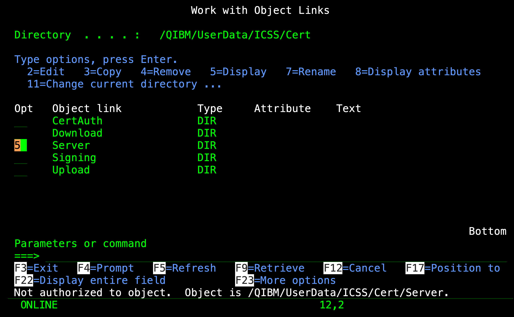

# WOPASE

### Without PASE — A Native ILE Package Manager for IBM i

**WOPASE** installs IBM i packages directly from GitHub repositories 
using only native ILE CL and system APIs.
No PASE environment, no `curl`, no `bash`, no `git` — just pure ILE. 

Curiously, *WOPASE* is also the name of a fine yarn of Italian origin...

WOPASE is the evolution of [PASERIE](https://github.com/AndreaRibuoli/PASERIE), 
redesigned from the ground up to eliminate all dependencies on the PASE environment. 
Where PASERIE relied on PASE tools (`curl`, `bash`, `git`) for downloading and bootstrapping 
and on PASE `libcurl` for executing, WOPASE implements HTTPS communication natively in ILE CL 
using sockets, GSKit TLS, and `iconv` for codepage conversion.

```
              GitHub Repository
              ┌────────────────┐
              │  GUIDANCE.TXT  │
              │  QCLSRC/       │
              │  QCMDSRC/      │
              │  ...           │
              └───────┬────────┘
                      │
               HTTPS / TLS 1.2+
               (GSKit + sockets)
                      │
              ┌───────▼────────┐
              │                │
              │   Q T E M P    │
              │                │
              └───────┬────────┘
                      │
            QTEMP/QCLSRC(BUILD)
           compiled and executed
                      │
              ┌───────▼────────┐
              │                │
              │  Target  Lib   │
              │                │
              └────────────────┘
```

## Why WOPASE?

PASERIE requires a working PASE environment with open-source packages installed from a 32-bit customized bundle.
WOPASE removes it entirely:

- **Zero external dependencies** — everything runs in ILE, using only APIs shipped with IBM i
- **Direct TLS connection** — connects to `raw.githubusercontent.com` over HTTPS using GSKit
- **Automatic codepage handling** — converts UTF-8 content from GitHub to EBCDIC via `iconv`
- **Same GUIDANCE.TXT format** — fully compatible with existing PASERIE-packaged repositories

## Installation

The simplest installation is via PASERIE:

```
PASERIE/INSTALL REPO_OWNER(AndreaRibuoli) REPOSITORY(WOPASE)
```

Should you prefer, I can provide you a SAVEFILE (see e-mail below). 

The only requirement is the presence of CA certificates 
in the IBM i **\*SYSTEM** certificate store enabling SSL sessions
with `raw.githubusercontent.com`. When missing, they can be 
loaded by means of IBM i *Digital Certificate Manager* (**DCM**).

In order for you to run WOPASE/INSTALL successfully also check if you are authorized
to `/QIBM/UserData/ICSS/Cert/Server` path:



You will need the following rights:

* **\*RX** on `/QIBM/UserData/ICSS/Cert/Server` and 
* **\*R** on `/QIBM/UserData/ICSS/Cert/Server/DEFAULT.KDB`

To diagnose what is not working as expected you can always use the `VERBOSE(L)` option.
In this case the printout will report:

```
*...+....1....+....2....+....3....+....4....+....5....+....6....+....7....+....8
API gsk_environment_init() failed with GSK_IBMI_ERROR_NO_ACCESS (6003)          
```

## Updates

To perform an update, *WOPASE* can rebuild itself from latest GitHub source code:

```
WOPASE/INSTALL REPO_OWNER(AndreaRibuoli) REPOSITORY(WOPASE)
```

## Usage

```
WOPASE/INSTALL REPO_OWNER(AndreaRibuoli) REPOSITORY(SIMPLE)
```

### Command Parameters

| Parameter | Description | Default |
|-----------|-------------|---------|
| **REPO_OWNER** | GitHub repository owner | *(required)* |
| **REPOSITORY** | Repository name | *(required)* |
| **YOURGITPAT** | GitHub personal access token | `*NONE` |
| **TGTLIB** | Target library for compiled objects | `*REPOSITORY` |
| **TGTRLS** | Target release for compilation | `*CURRENT` |
| **DEVOPT** | Development option | `N` |
| **LOGOUTPUT** | Job log output handling | `*PND` |
| **VERBOSE** | Verbose mode | `N` |

## How It Works

WOPASE consists of three components:

### 1. INSTALL command (INSTALL.CMD)

The user\-facing command definition. Provides prompted parameters with validation,
special values, and help text. This is what the operator interacts with from a 5250 session.

### 2. INSTALL program (INSTALL.CLLE)

The orchestrator. Receives parameters from the command, prepares the environment,
and spawns the core installer as a separate process using the POSIX `spawnp()` API.
It then waits for completion with `waitpid()`, retrieves the spawned job information
via `Qp0wGetJobID`, and handles job log cleanup.

### 3. INSTALL_S program (INSTALL_S.CLLE)

The engine. This is where the actual work happens:

1. **DNS resolution** — resolves `raw.githubusercontent.com` via `gethostbyname`
2. **Socket connection** — opens a TCP socket and connects to port 443
3. **TLS handshake** — establishes a secure session using GSKit (`gsk_environment_open`, `gsk_secure_soc_init`, etc.)
4. **Downloads GUIDANCE.TXT** — sends an HTTP GET request over TLS, parses the `Content-Length` header, reads the full response body
5. **Converts to EBCDIC** — uses `QtqIconvOpen` and `iconv` to convert UTF-8 content to the job CCSID
6. **Processes the manifest** — iterates over each line of GUIDANCE.TXT:
   - `*PREREQ` lines verify that a required library exists and installs it if missing
   - `*LANGUAGE` lines enable locale-specific QCMDSRC source sub-directories
   - `*OSRELEASE` lines enable OS-version-specific QCLSRC source sub-directories
   - All other lines trigger the download of a source member
7. **Downloads each source member** — repeats the HTTPS request/response/convert cycle for every member listed
8. **Stores in QTEMP** — writes each converted source into the appropriate source physical file in QTEMP
9. **Compiles and runs BUILD** — compiles `QTEMP/QCLSRC(BUILD)` into a program and calls it, passing the target library, target release, and development options

## The GUIDANCE.TXT Manifest

The `GUIDANCE.TXT` file in the root of a repository tells WOPASE what to download and how to build it.
Each line follows *a fixed-column format* (10+10+10+50 characters):

```
|  SRCFILE  |  SRCMBR   |  SRCTYPE  |  SRCDESC (text description)                    |
```

### Regular entries

```
QCLSRC    BUILD     CLLE      Build procedure
QCLSRC    MYPROGRAM CLLE      Main program
QCMDSRC   MYCMD     CMD       Command definition
QDDSPF    MYSCREEN  DSPF      Display file
```

Each entry causes WOPASE to download `SRCFILE/SRCMBR.SRCTYPE` from the repository
and store it as member `SRCMBR` in source physical file `QTEMP/SRCFILE`.

### Special directives

```
*PREREQ   TMKMAKE                 AndreaRibuoli
```
Verifies that library `TMKMAKE` exists on the system before proceeding.
If missing, the installation submits a new WOPASE/INSTALL.

```
*LANGUAGE 2932                    Italian
```
If the system's language feature code matches `2932`, enables downloading
from a QCMDSRC locale-specific subdirectory for subsequent `QCMDSRC` entries.

```
*OSRELEASE V7R5M0                IBM i 7.5
```
If the system's OS version matches `V7R5M0`, enables downloading
from a QCLSRC version-specific subdirectory for subsequent `QCLSRC` entries.

### Writing a BUILD.CLLE

Every WOPASE-compatible repository must include a `QCLSRC/BUILD.CLLE` member.
This program receives three parameters and handles the actual compilation
of all objects into the target library:

```
PGM PARM(&DEVOPT &TGTRLS &TGTLIB)
DCL VAR(&DEVOPT) TYPE(*CHAR) LEN(1)
DCL VAR(&TGTRLS) TYPE(*CHAR) LEN(10)
DCL VAR(&TGTLIB) TYPE(*CHAR) LEN(10)
/* Your build logic here */
ENDPGM
```

The build program has full control over compilation strategy: it can use `CRTBNDRPG`, `CRTBNDCL`,
`CRTSQLRPGI`, `TMKMAKE`, or any other approach appropriate for the package.

## Compatibility with PASERIE

WOPASE uses the same `GUIDANCE.TXT` format and the same `BUILD.CLLE` conventions as PASERIE.
Repositories already packaged for PASERIE will work with WOPASE without modification.

If you are migrating from PASERIE, the only change is the command library:

```
/* Before (PASERIE) */
PASERIE/INSTALL REPO_OWNER(AndreaRibuoli) REPOSITORY(MYPACKAGE)

/* After (WOPASE) */
WOPASE/INSTALL REPO_OWNER(AndreaRibuoli) REPOSITORY(MYPACKAGE)
```

## Technical Details

WOPASE uses exclusively native IBM i APIs:

| Function | API Used |
|----------|----------|
| DNS resolution | `gethostbyname`, `inet_addr` |
| TCP connection | `socket`, `connect` |
| TLS/SSL | GSKit: `gsk_environment_open`, `gsk_secure_soc_init`, `gsk_secure_soc_read`, `gsk_secure_soc_write` |
| Codepage conversion | `QtqIconvOpen`, `iconv` |
| Memory management | `malloc`, `free`, `memcpy` |
| File I/O | `open`, `write`, `close`, `_Ropen`, `_Rreadn`, `_Rupdate` |
| Process management | `spawnp`, `waitpid`, `Qp0wGetJobID` |

No PASE programs, no QShell scripts, no external downloads are involved at runtime.

## Differences from PASERIE

| | PASERIE | WOPASE |
|---|---------|--------|
| **Runtime environment** | ILE + PASE | ILE only |
| **HTTPS client** | `libcurl` (via PASE) | GSKit + sockets (native) |
| **Bootstrap** | `bash` + `git clone` | *(native — TBD)* |
| **External dependencies** | `32-bit libcurl` | None |
| **Minimum IBM i version** | 5.4 (partial), 6.1+ | *7.3* |
| **GUIDANCE.TXT format** | Same | Same |
| **BUILD.CLLE interface** | Same | Same |

## Author

**Andrea Ribuoli** — [andrea.ribuoli@yahoo.com](mailto:andrea.ribuoli@yahoo.com)

- GitHub: [github.com/AndreaRibuoli](https://github.com/AndreaRibuoli)
- Original project: [PASERIE](https://github.com/AndreaRibuoli/PASERIE)

## License

*MIT License*